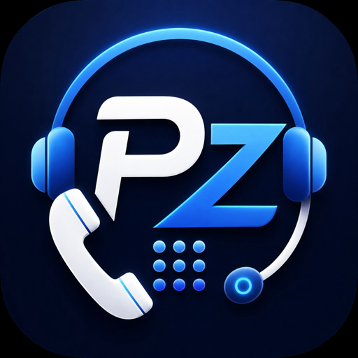

<p align="center">
  
</p>

# PhoneZero

[](LICENSE)

Enable voice-to-voice tasks in Grok Bot and Cursor. PhoneZero is a **runtime** plus **phone skills**. The first skill books a restaurant table by phone; chat reports exactly one outcome: `succeeded` (`booked` alias) `| unavailable | no_answer | needs_user | unknown | failed`. Custom asks: Cursor local skill folder, or Grok interviews into a task JSON. **Zero infrastructure.** [MIT](LICENSE). Sample implementation — use is on you; see [Disclaimer](DISCLAIMER.md). No product support. YMMV. How-to: [docs/SKILLS.md](docs/SKILLS.md).

## What you need

Setup stops without all of these:

- Telnyx: KYC done, one US number, API key
- xAI: team with Zero Data Retention **off**, that team’s API key, Voice Agent Builder at [console.x.ai](https://console.x.ai)

**Not on the Cursor Marketplace yet.** Grok Bot: point it at this repo and say *set this up*. Cursor IDE: Customize → Plugins → **+ Add** this repo root.

---

## If you are a Grok Bot (computer-use) — set this up

You were pointed at `https://github.com/function1st/PhoneZero`. Drive the UI. Do these steps **in order**. Same playbook: [AGENTS.md](AGENTS.md). After the ids are in session: [plugins/phonezero/skills/phonezero-runtime/SKILL.md](plugins/phonezero/skills/phonezero-runtime/SKILL.md) and the matching phone skill ([book-restaurant](plugins/phonezero/skills/book-restaurant/SKILL.md), or interview a custom `phonezero-task` — do not ask for a `SKILL.md` paste).

### Hard no

- Do **not** Customize → **+ Add** this repo as a **Cursor** plugin. Stdio Telnyx on Grok → **10009**.
- Do **not** click **Authenticate** on Telnyx. There is no sign-in.
- Do **not** take keys in chat. Do **not** `source ~/.phonezero/env`. Do **not** run `scripts/provision.sh` here.
- Do **not** search the Telnyx MCP catalog for `whoami` or `/v2/whoami`. Those are not tools. SID is `list_billing_groups` (step 6).
- Do **not** treat “no Grok xAI *package*” as “cannot upload.” Add/use the PhoneZero xAI MCP (step 5).
- Do **not** silently keep PhoneZero / AI-disclaimer ON. Ask (step 1) and wait.
- Do **not** collect destination countries as a PhoneZero setting. They live on the Telnyx outbound voice profile (step 6).

### 0. Vendor gate

Need: Telnyx KYC + US DID + Telnyx key; xAI team **ZDR off** + that team’s key; Builder at [console.x.ai](https://console.x.ai) unless they already said xAI is set up. If missing, stop.

### 1. Ask in chat — name and AI disclaimer (wait)

Do **not** keep defaults silently. Show this and wait. **Do not ask for countries** — those are Telnyx (step 6).

```
Call settings (defaults — change any now)
1. Spoken name: PhoneZero
2. AI disclaimer: ON  (you may turn this OFF)
```

Write answers into Edit Values / xAI env. If they turn disclaimer OFF and Builder already exists, re-paste the prompt once with `{disclosure_clause}` empty.

### 2. Uninstall Cursor PhoneZero if it is installed

### 3. Add Telnyx as HTTP MCP

| Field | Value |
|---|---|
| Name | `telnyx` |
| URL | `https://api.telnyx.com/v2/mcp` |
| Header | `Authorization` = `Bearer ` + the key **in that form** |

Not stdio, not `npx`. If Grok-native **phonezero-grok** exists: install it, **Edit Values** (keys **and** name / disclose from **1**). [`.grok/config.toml`](.grok/config.toml) is the same HTTP Telnyx if this Bot already loads project Grok MCP.

### 4. Prove Telnyx

`list_api_endpoints` → real list, or stop. `401` / **10009** → fix the header. “6 tools” / **Needs auth** prove nothing.

### 5. Add the PhoneZero xAI MCP

If `put_task` or `put_booking` is already listed, skip. Else Customize → MCPs → **stdio** `xai`: copy `xai` from [`plugins/phonezero/mcp.json`](plugins/phonezero/mcp.json). Real secrets in env, not `${…}`, plus name / disclose from **1**. Prove: `get_call_config` + `ensure_collection` (`PhoneZero bookings`). If they said xAI is already set up: do **not** open the Builder. Ignore the wizard xAI number. Existing Builder agents need a one-time re-paste of [`prompts/voice-agent.md`](plugins/phonezero/prompts/voice-agent.md) and [`prompts/end_call.md`](plugins/phonezero/prompts/end_call.md) before custom skills will speak correctly.

Fallback only if stdio will not start: Bearer on `https://api.x.ai/v1` and `/v2` (`putBooking` in [`plugins/phonezero/scripts/xai-mcp.mjs`](plugins/phonezero/scripts/xai-mcp.mjs)). `403` + ZDR → stop.

### 6. Session ids now (before any plan)

Keep in session. Do not look these up after yes.

1. `TELNYX_ACCOUNT_SID` — `invoke_api_endpoint` `list_billing_groups` args `{ "jq_filter": "[.data[].organization_id] | unique" }`
2. `PHONEZERO_TEXML_APP_ID` — `invoke_api_endpoint` `list_texml_applications` args `{ "filter": { "friendly_name": "PhoneZero" }, "jq_filter": ".data[] | {id, friendly_name}" }`
3. From — `get_call_config` (last-4 in chat)
4. Destinations — `invoke_api_endpoint` `list_outbound_voice_profiles` (name `PhoneZero US-only` → `whitelisted_destinations`). Show the list. This is **Telnyx** (Mission Control → Voice → Outbound voice profiles), not a PhoneZero field. PATCH only if they ask to add/remove countries.

### 7. Provision only if missing

If profile **PhoneZero US-only**, app **PhoneZero**, and the DID is attached: skip create. Do not overwrite an existing whitelist unless they asked. Else skill Setup via MCP names: `list_outbound_voice_profiles` / `create_outbound_voice_profiles` (create default `["US"]`), `create_texml_applications` (`voice_url` = `https://raw.githubusercontent.com/function1st/PhoneZero/main/texml/inbound.xml`, verify 200), `update_phone_numbers` `connection_id`. xAI: `register_byo_number` + `attach_agent` on **your** DID if needed.

### 8. First call

Plan-first. Show Spoken as. Only dial countries on the Telnyx profile whitelist. On yes: `put_task` (or `put_booking` alias; wait processed) → `calls_accounts_texml_calls` with the session ids → poll `retrieve_calls_accounts_texml_calls` → `retrieve_recordings_json_calls_accounts_texml_recordings_json` → `transcribe` → classify → `delete_booking` (live brief only). Keep the Telnyx recording. Do not paste the audio URL. Owner setup-test to their own confirmed number may skip the hours guard. Custom task: interview into a `phonezero-task` ([docs/SKILLS.md](docs/SKILLS.md)). If they say save as a template, pick memory or `put_template` and tell them where it went.

---

## If you are Cursor IDE

1. Telnyx KYC + US DID; xAI team **ZDR off**; keys. [docs/SETUP.md](docs/SETUP.md).
2. Install the **Cursor** package ([`.cursor-plugin/marketplace.json`](.cursor-plugin/marketplace.json) → [`plugins/phonezero/`](plugins/phonezero/)): Marketplace, Customize → **+ Add** this repo root, or `rsync -a plugins/phonezero/ ~/.cursor/plugins/local/phonezero/` then Reload Window.
3. Plugins → Configure: `TELNYX_API_KEY`, `PHONEZERO_FROM_NUMBER`, `XAI_API_KEY`. Defaults for name / disclose. Destinations are Telnyx, not this card. Not SID / TeXML / collection ids. New chat. `list_api_endpoints` + `get_call_config`.
4. `/setup-phone-calling` then `/book-table` (or `/book-restaurant`, `/confirm-business-hours`). Local private skills: [docs/SKILLS.md](docs/SKILLS.md).

Cursor Telnyx is stdio (`npx @telnyx/mcp`). Do not add hosted-HTTP Telnyx in the Cursor plugin (SSE GET 404 tombstone). `scripts/provision.sh` is developer-only on a personal machine — never on the Bot.

## Architecture

Two hosted platforms provide every runtime piece; PhoneZero itself is a skill, prompts, and config.

```
Me: "Book Joe's Pizza, Friday 7pm, party of 2"  (or a custom skill / Grok interview)
  ▼
Cursor / Grok Bot
  │ 1. tries online booking first (OpenTable/Resy via browser); if none:
  │ 2. presents the call plan in chat; on my yes:
  │ 3. places the call via the Telnyx hosted MCP tool
  ▼
Telnyx To = sip:{PHONEZERO_FROM_NUMBER}@sip.voice.x.ai;transport=tls  (agent answers)
  ▼
Inline Texml: <Pause length="3"/><Dial>{restaurant}</Dial>
  ▼
Agent loads phonezero-task.json during the pause, hears ringback, talks to the host
                  negotiates within the window · classify from the transcript
                                  ▼
Chat polls for call completion, fetches recording media_url
(Telnyx MCP) → transcribes with xAI STT (POST /v1/stt, multichannel)
──▶ confirms outcome in chat · books my calendar if asked
    (keep the Telnyx recording; delete the live brief)
```

**Verified (Aug 2026):** MCP dial → agent answers → collection JSON brief → Pause then callee Dial → dual-channel recording → xAI STT. Keep the Telnyx recording.

## Cost

| Item | Cost |
|---|---|
| Infrastructure | **$0** |
| Telnyx DID | ~$1/mo |
| Telnyx outbound + SIP leg + recording | ~$0.01/min |
| Grok voice agent audio (xAI) | $0.05–0.08/min |
| A 6-minute booking | ≈ $0.40–0.55 |

## How it works

The agent plans the call in chat and waits for your yes. Facts go in `phonezero-task.json` in the xAI file collection. One Telnyx MCP call sets `To` to `sip:{PHONEZERO_FROM_NUMBER}@sip.voice.x.ai;transport=tls`. Inline TeXML ([`plugins/phonezero/texml/bridge.xml`](plugins/phonezero/texml/bridge.xml)) pauses 3s then dials the callee. Dual-channel recording is call-level. Telnyx cannot transcribe Dial-verb recordings — fetch `media_url`, then xAI `POST /v1/stt`. Keep the recording; delete the live brief after classify (keep templates).

Keys live in Configure / MCP headers only — not the agent shell.

## Defaults

This sample ships with:

- **Destinations:** Telnyx outbound voice profile **PhoneZero US-only**, `whitelisted_destinations` default `US` on create (Mission Control → Voice → Outbound voice profiles)
- **AI disclosure:** `PHONEZERO_DISCLOSE_AI` default **on**
- **Spoken name:** `PhoneZero`
- **Recording:** dual-channel Telnyx recording on every call; the opener says the call is on a recorded line
- **Hours / attempts:** runtime + skill defaults (see [`plugins/phonezero/skills/phonezero-runtime/SKILL.md`](plugins/phonezero/skills/phonezero-runtime/SKILL.md))

These are product defaults, not a compliance program.

## Disclaimer

This repository is a **sample implementation and plugin**. It is provided **AS IS** under the [MIT License](LICENSE), without warranty of any kind.

**You** are solely responsible for whether and how you use PhoneZero — including all applicable laws, regulations, and third-party terms (Telnyx, xAI, calling, recording, AI disclosure, privacy). Function1st and the authors/contributors accept **no liability** for your use, configuration, or implementation.

See also the [Disclaimer](DISCLAIMER.md). Nothing here is legal advice.

## License

[MIT](LICENSE)
